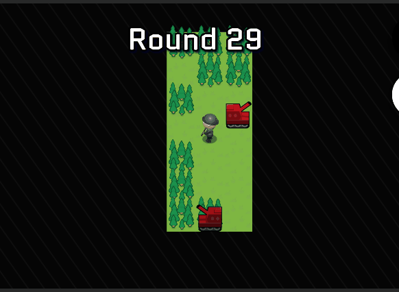
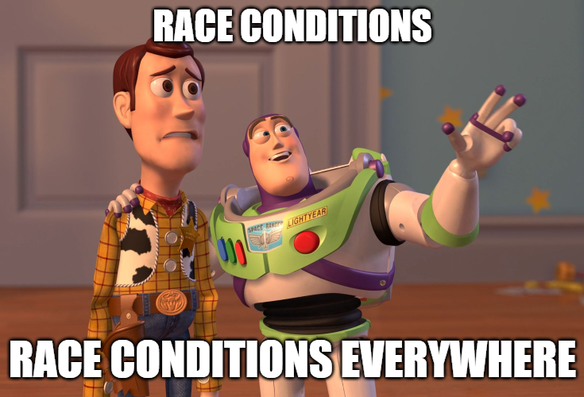
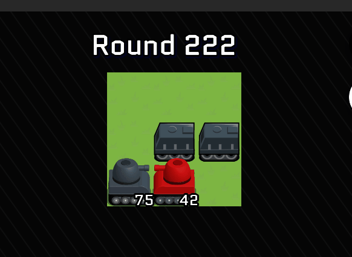
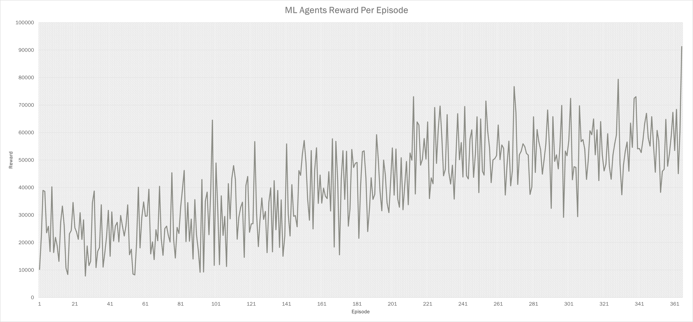

# ML Agents For Banality Wars

## Inspiration

I had a pretty good AI for my strategy game. But it wasn't that good. Sure, it can beat you in a game, but only if it had a lot more income than you. I wanted to improve it, but I was sort of at a dead end. I used a basic utility system (Meaning every possible move is scored based on some criteria and then the best move was chosen) because it was really easy to implement but I had no clue how to improve it.

Also I had this idea for a new mode called 'manual chess'. Basically instead of having each turn consist of moving every single unit and building as much stuff as you can manual chess mode would have each player move or build a single unit. The only problem is that this would required a major redesign of the AI as right now it just assumes every unit gets to move every turn.

## Summary

So I chose to implement my new AI using Unity's ML Agents. Basically it would still use a utility function except this time instead of me specifying the utility, ML Agents would calculate it for me. This way I can very easily retrofit my existing code and it reduces the liklihood of overfitting the data. What could possibly go wrong?

## Challenges

There were a few challenges. First there was the fact that all the ML Agents tutorials conveniently left out two key pieces of information because they are apparently all copy paste jobs of each other.

The first is that the values have to be normalized. I mean, it'll still work if the values aren't normalized, but if you have values signifcantly out of range it won't work. I had a value damage * unitValue. And unitValue was something like 20000 and damage was normalized. So if your values are that out of range it'll take the network forever to learn with them.

And the second is that the code that actually runs the neural network isn't instant. Well, not instant. More like synchronous.

This may not sound like a big deal, but my AI makes decisions very very quickly. As in less than a millisecond it could get all the moves. So because it was so fast it was getting the move before the external Tensorflow code could make a decision and all the utilities of the moves I got were all the same making the system completely useless.

I don't know how other people solved this problem. I can only assume they are not aware of it or they ignore it.

Anyways, the way I solved it is I had to make my code wait for the Tensorflow code to finish. And to do that I had to use another thread.

That also brings me to another problem I had.

My code was designed to combat normal race conditions in normal play. But it was not designed for training which would play back the game faster than any human. I had to make a lot of changes to make sure things would not break.

## Reflections

I'm glad I undertook this challenge to learn ML Agents. It was a fun month. And I found a bunch of potential race conditions in my code. But at the end of the day I've decided that ML Agents is not a viable method for implementing AI in my game.

So this is a picture of the AI reward score for each game. It's going slowly but steadily up. Which is good. It means the AI is learning. But the thing is the AI only learns so much. Eventually the charts look like this.

[]

As you can see the AI Agent is not learning at all. We're 300 tries in and we still have a 95% failure rate. Why? Who knows. My current hypothesis is the data the agent is getting is far too noisy to make a prediction about what to do next. I noticed this when I disabled RNG.

So my game adds 0-10% extra damage based on RNG similar to Advance Wars. I found that by simply disabling this I was able to reduce training times by 25%. From this I can conclude that neural networks do not like RNG. But large maps inherently have a lot of RNG.

So if I were to reduce the RNG I would have to make maps that only specifically test one thing. I don't know how I'd start with that. This is way too much work and even then I don't know how much the information would generalize.

I actually experimented with this with HQ capturing. I taught the AI to capture the HQ. But did this improve the AI on general maps? Nope. Not at all. It is truly disheartening to not see any progress and even a regression.

Speaking of the HQ capture test look at this:

[]

How many episodes does it take the infantry to capture the HQ? 955. Like what are you doing? If you were just selecting a tile at random to interact with I'd expect at most 100 moves (because selecting a unit allows us to idle or sell the unit).

And then after that it got a pretty big reward for capturing. But does it capture again? No. A thousand more turns and still no capture.